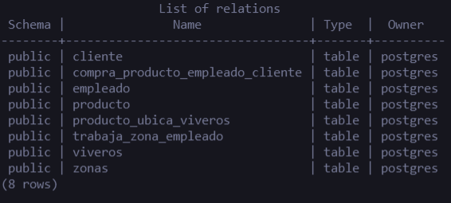
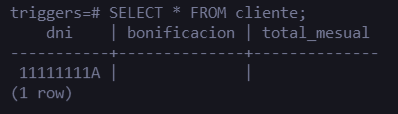
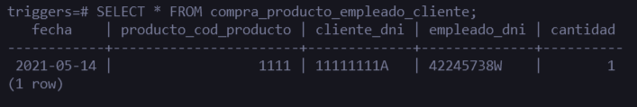
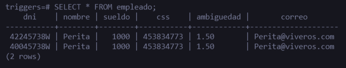
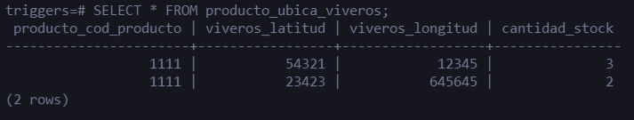
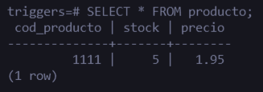
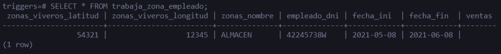
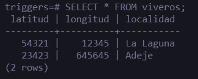
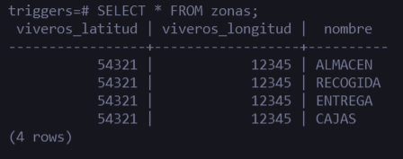

# Modelo Lógico Relacional (Disparadores): Viveros
----------
> Alejandro Peraza González  
> Gabriel García Jaubert  
> Elena Rijo García  
>
> University of La Laguna
>
> 13 november 2021

## Imágenes sobre los SELECT de cada tabla  

