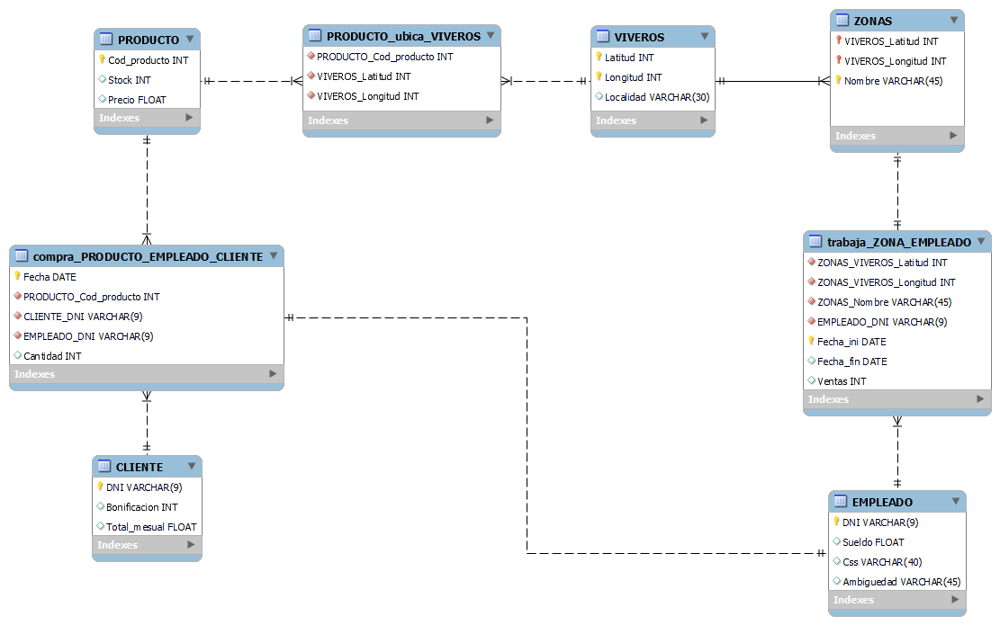
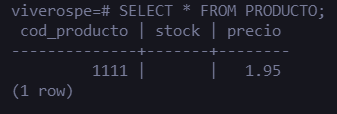
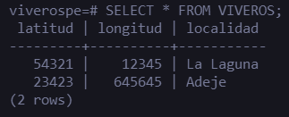
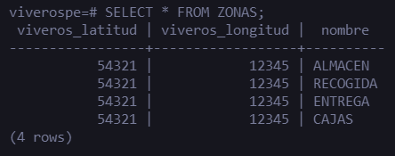
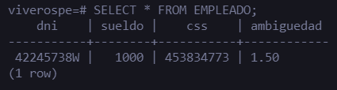
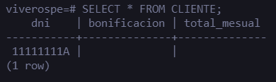
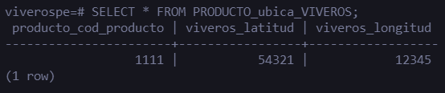
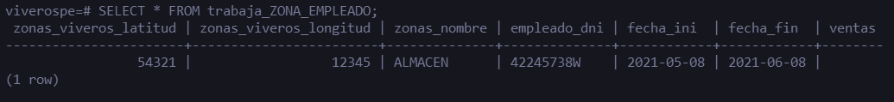
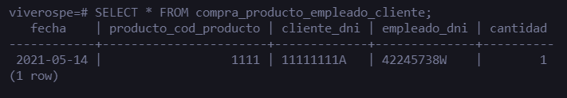

# Modelo Lógico Relacional: Viveros
----------
> Alejandro Peraza González  
> Gabriel García Jaubert  
> Elena Rijo García  
>
> University of La Laguna
>
> 1 november 2021

## Imagen del diseño realizado con MySQL Workbench

## Modelo realizado con MySQL Workbench (fichero con extensión .mwb)

[Viveros WorkBench](./Viveros.mwb)

## Script SQL generado para construir la base de datos (ficher con extensió .sql)

[Viveros Script](./viveros.sql)

## Imagen con la salida de un SELECT de cada tabla de la base de datos  

